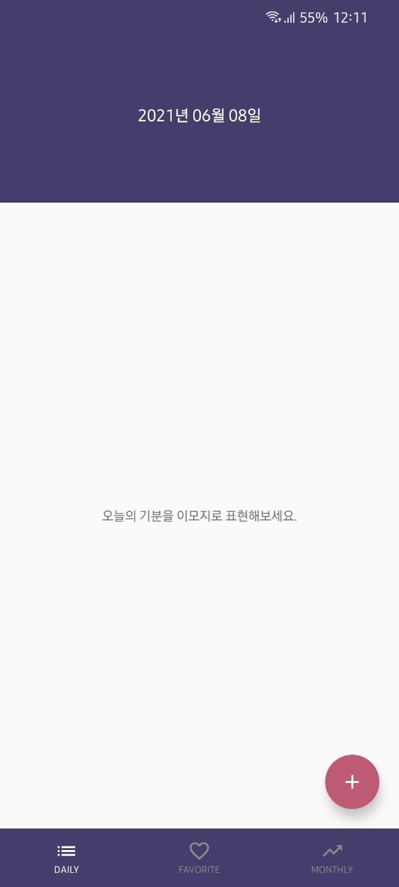
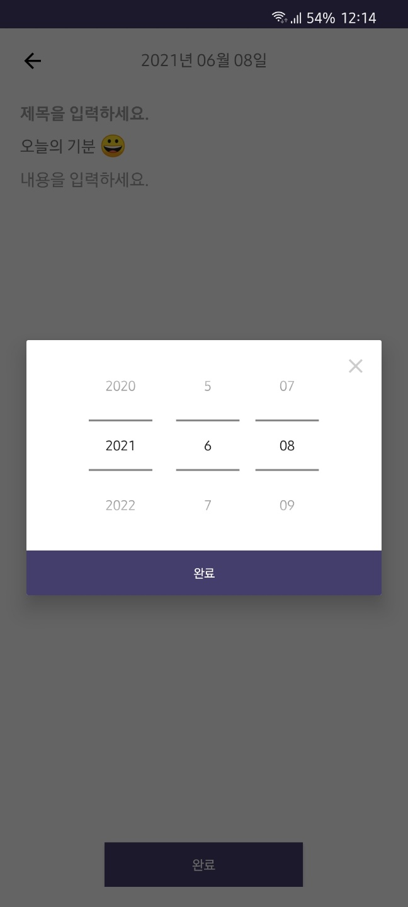
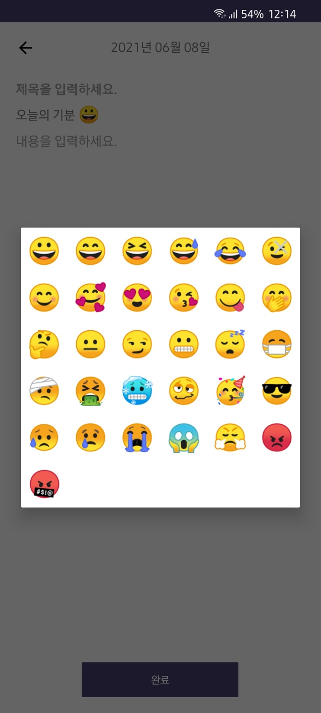
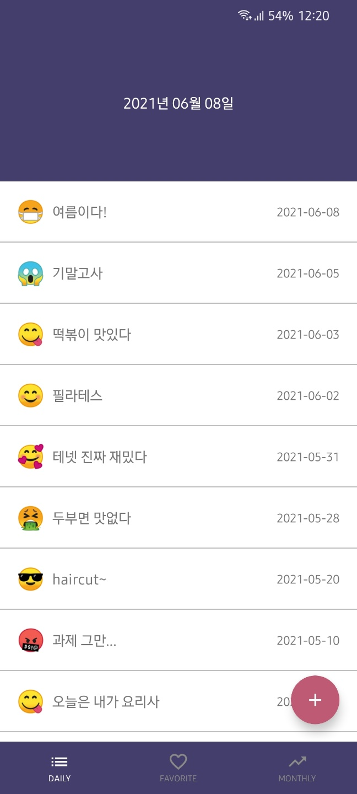
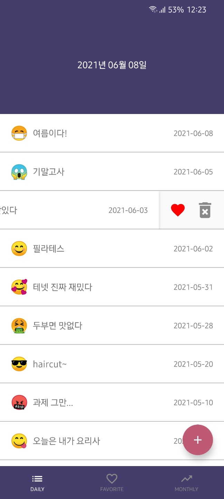
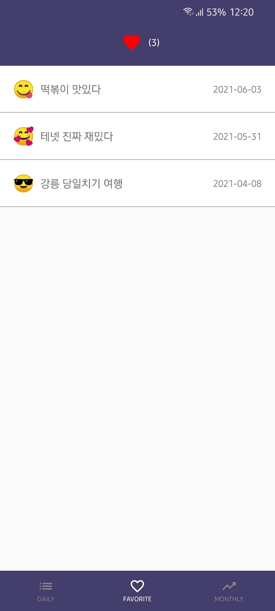
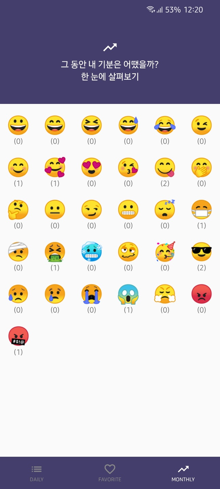
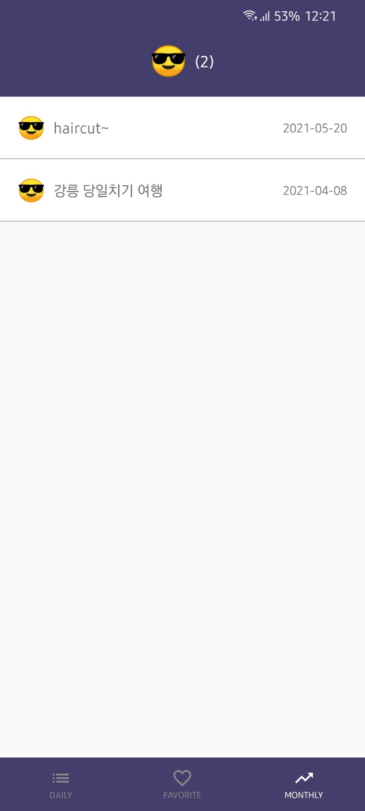

# :wink: 이모지로 나타내는 오늘의 기분 :calendar:


## :wave: Introduction
이 앱은 이모지를 이용한 다이어리 어플리케이션입니다.
1. 오늘의 기분을 이모지를 선택해 표현할 수 있습니다.
2. 좋아요 한 일기를 모아 볼 수 있습니다.
3. 이모지별 일기 개수를 확인하고 모아 볼 수 있습니다.
4. 다국어(영어/한국어)를 지원합니다.

## :camera: Screenshots
  

  

  

## :sparkles: Features
|     Activity/Fragment    |                          Description                           |
| :----------------------: | :------------------------------------------------------------: |
|      `MainActivity`      |                      메인 화면 (탭 선택)                       |
|      `AddActivity`       |                      일기 추가/수정 화면                       |
|   `MainDailyFragment`    |                모든 일기 목록을 보여주는 화면                   |
|   `MainLikeFragment`     |           사용자가 좋아요 한 일기 목록을 보여주는 화면          |
|  `MainMonthlyFragment`   |               이모지별 일기 개수를 보여주는 화면                |
|   `MainEmojiFragment`    |            선택한 이모지의 일기 목록을 보여주는 화면            |

## :art: Project Structure
```
📁 app/src/main/java/org/techtest/emoji_diary
 ├ 📁 database : 데이터베이스 관련 폴더
 │  ├ 📁 dao : 데이터 접근을 돕는 Data Access Object 폴더
 │  │  ├ 📄 DiaryDao.kt
 │  │  └ 📄 EmojiDao.kt
 │  ├ 📁 entity : 데이터베이스 테이블 폴더
 │  │  ├ 📄 DiaryEntity.kt : 일기 데이터 모델
 │  │  └ 📄 EmojiEntity.kt : 이모지 데이터 모델
 │  └ 📄 AppDatabase.kt : 데이터베이스 정의
 ├ 📁 ui : 화면 구성 폴더
 │  ├ 📁 adapters : recyclerview adapter 폴더
 │  │  ├ 📄 DiaryAdapter.kt : 일기 목록 recyclerview adapter
 │  │  ├ 📄 EmojiAdapter.kt : 이모지별 일기 탭의 recyclerview adapter
 │  │  └ 📄 EmojiDialogAdapter.kt : 이모지 선택 다이얼로그의 recyclerview adapter
 │  ├ 📁 fragments : 프래그먼트 폴더
 │  │  ├ 📄 MainDailyFragment.kt : 모든 일기 목록 화면
 │  │  ├ 📄 MainEmojiFragment.kt : 이모지별 일기 목록 화면
 │  │  ├ 📄 MainLikeFragment.kt : 좋아요 한 일기 목록 화면
 │  │  └ 📄 MainMonthlyFragment.kt : 이모지별 일기 개수 화면
 │  ├ 📄 AddActivity.kt : 일기 추가/수정 화면
 │  └ 📄 MainActivity.kt : 메인 화면 탭 구성
 ├ 📁 viewmodel : 데이터와 UI를 연결하는 뷰모델 관련 폴더
 │  ├ 📄 DiaryViewModel.kt
 │  └ 📄 EmojiViewModel.kt
 ├ 📄 DataRepository.kt : 싱클톤으로 여러 데이터를 관리하는 클래스
 └ 📄 MyApplication.kt : 프로젝트에서 공통으로 사용되는 것들 정의
```

## :hammer: Development Environment
- Kotlin
- Android Studio @4.0.1
- minSdkVersion : 15
- targetSdkVersion : 28

## :books: Libraries Used
- [Room](https://developer.android.com/jetpack/androidx/releases/room?hl=ko) : local database 라이브러리
- [LiveData](https://developer.android.com/topic/libraries/architecture/livedata?hl=ko) : 데이터 변경을 관찰하는 data holder 클래스 라이브러리
- [ViewModel](https://developer.android.com/topic/libraries/architecture/viewmodel?hl=ko) : UI 관련 데이터를 유지하기 위한 라이브러리
- [Floating Action Button](https://github.com/makovkastar/FloatingActionButton) : floating action button 라이브러리
- [RecyclerViewEnhanced](https://github.com/nikhilpanju/RecyclerViewEnhanced) : swipe, click 기능을 제공하는 recyclerview 라이브러리
