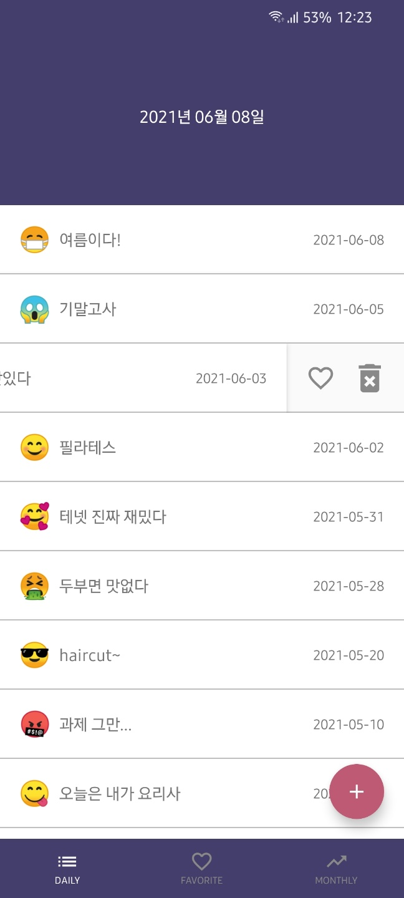

# :wink: 이모지로 나타내는 오늘의 기분 :calendar:

## :wave: Introduction
이 앱은 이모지를 이용한 다이어리 어플리케이션입니다.
1. 오늘의 기분을 이모지를 선택해 표현할 수 있습니다.
2. 좋아요 한 일기를 모아 볼 수 있습니다.
3. 이모지별 일기 개수를 확인하고 모아 볼 수 있습니다.

## :camera: Screenshots
  

  

  

## :sparkles: Features
|     Activity/Fragment    |                          Description                           |
| :----------------------: | :------------------------------------------------------------: |
|      `MainActivity`      |                      메인 화면 (탭 선택)                       |
|      `AddActivity`       |                      일기 추가/수정 화면                       |
|   `MainDailyFragment`    |                모든 일기 목록을 보여주는 화면                   |
|   `MainLikeFragment`     |           사용자가 좋아요 한 일기 목록을 보여주는 화면          |
|  `MainMonthlyFragment`   |               이모지별 일기 개수를 보여주는 화면                |
|   `MainEmojiFragment`    |            선택한 이모지의 일기 목록을 보여주는 화면            |

## :hammer: Development Environment
- Kotlin
- Android Studio @4.0.1

## :bookmark: Application Version
- minSdkVersion : 15
- targetSdkVersion : 28

## :books: Libraries Used
- [floating action button](https://github.com/makovkastar/FloatingActionButton) : floating action button 라이브러리
- [room](https://developer.android.com/jetpack/androidx/releases/room?hl=ko) : local database 라이브러리
